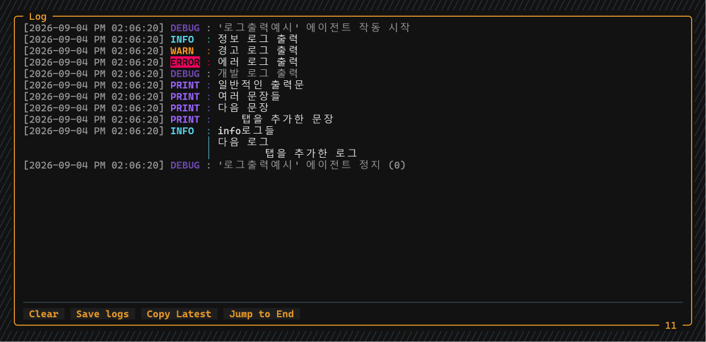

# nexuspy.log 가이드

Nexus App에서 로그를 확인할 수 있도록 합니다. 일반적인 `print()`와 시각적 구분을 지원합니다.

**예시 코드** (`로그출력예시.py`)
```python
import nexuspy.log as log

log.info("정보 로그 출력")
log.warn("경고 로그 출력")
log.error("에러 로그 출력")
log.debug("개발 로그 출력")
print("일반적인 출력문")

# 자동 줄바꿈 미지원
print("""여러 문장들
다음 문장
    탭을 추가한 문장""")

# 자동 줄바꿈 지원
log.info("""info로그들
다음 로그
        탭을 추가한 로그""")
```

**코드 실행 결과**


> 일반적인 `print()`는 자동 줄바꿈을 지원하지 않으며, 에이전트 내에서 `print()`를 사용해도 로그에 표시되지만, 레벨 분류를 위해 `nexuspy.log`를 사용하는 것을 권장합니다.

---
### 로그 레벨 상세

| 레벨 | rich style | 용도 |
|---|---|---|
| **ERROR** | bold reverse red | 복구 불가능한 에러 |
| **WARN** | bold yellow | 주의가 필요한 상황 |
| **INFO** | bold cyan | 일반 정보 (매매 신호, 상태 변경 등) |
| **DEBUG** | bold blue dim | 디버그용 상세 정보 |
| **PRINT** | bold blue | `print()`  자동 변환 |

---

### 주의사항
* 테마 색상에 따라 로그 색상이 다르게 표시될 수 있습니다. 기본 `rich style`값은 변경되지 않으나 내부적으로 가독성을 고려하여 자동으로 변경됩니다.
* Nexus App에서 디스코드 전송 기능을 사용할 시 로그가 웹훅 채널로 자동 전송됩니다. 하지만 이는 실시간이 아닌 배치 전송입니다. 약 3.5초 간격으로 일괄 전송됩니다.

